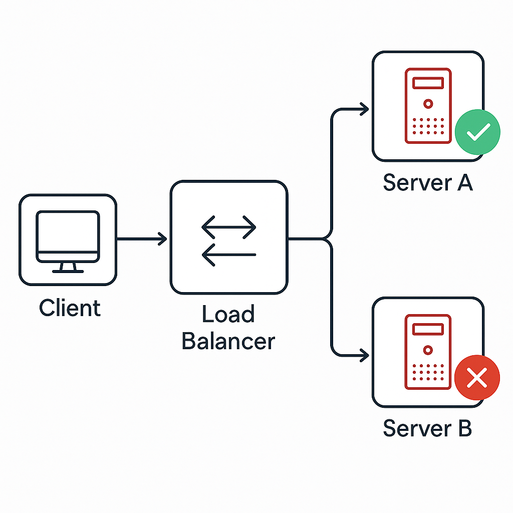
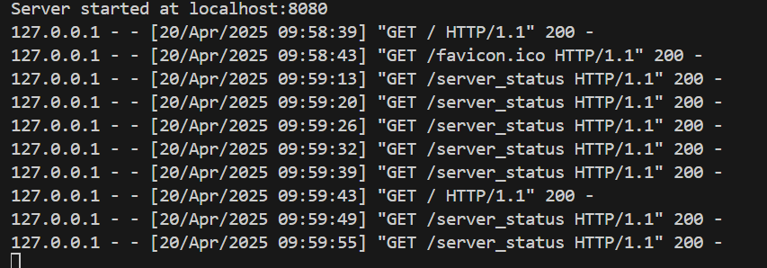

# Load-Balancer-with-health-check

A simple yet effective Python-based HTTP Load Balancer with live server health checks and a real-time web interface. Built using core Python modules and vanilla JavaScript, this project demonstrates the fundamentals of load balancing, server health monitoring, and frontend-backend integration.

---

## Features

- 🔁 **Round-Robin Load Balancing**: Evenly distributes incoming client requests across multiple backend servers.
- 🧠 **Health Checks**: Automatically detects down/unhealthy servers and skips them while routing requests.
- 🌐 **Web Interface**: Clean UI to send requests and visualize live status of all backend servers.
- 📊 **Per-Server Visitor Count**: Each server tracks and displays how many times it was visited.

---

## Project Structure

```
load-balancer-project/
├── backend/
│   ├── load_balancer.py        # Main load balancer logic
│   ├── round_robin.py          # Server cycling logic
│   ├── server1.py              # Example backend server 1
│   ├── server2.py              # Example backend server 2
│   └── server3.py              # Example backend server 3
├── frontend/
│   ├── index.html              # Web interface
│   ├── style.css               # Styling for UI
│   └── script.js               # JavaScript to interact with backend
├── requirements.txt            # Project dependencies
├── .gitignore                  # Git ignored files
└── README.md                   # Project documentation
```

---

## How to Run

### 1. Clone the Repository

```bash
git clone https://github.com/TanishqV5/Load-Balancer-with-health-check
cd LoadBalancer-Live
```

### 2. Install Dependencies

If required, install Python 3.11+ and run:

```bash
pip install -r requirements.txt
```

### 3. Run Backend Servers

```bash
python backend/server1.py
python backend/server2.py
python backend/server3.py
```

### 4. Start the Load Balancer

```bash
python backend/load_balancer.py
```

### 5. Open the Web Interface

Open `frontend/index.html` in your browser.

---

## Screenshots

   **Design**
   

1. **Project Overview**  
     
   *A clean and simple web interface for the load balancer.*

2. **All Servers Healthy**  
     
   *All backend servers are healthy and responding to requests.*

3. **One Server Down**  
     
   *The load balancer detects one server as unhealthy and skips it while routing requests.*
    


4. **All Servers Down**
    - **Webpage**
        
      *The web interface displays an error when all servers are down.*
    
    - **Logs**
        
      *Logs showing the health check failures for all servers.* 

5. **Server's responce and visitor count**  
    - **Frontend**
     
   *The response from the backend server includes the visitor count.*

   - **Backend**
     

6. **Server Logs**  
     
   *Logs from the load balancer showing health checks and request routing.*
   
---

## Concepts Demonstrated

- Networking basics (HTTP, ports, routing)
- Load balancing strategy
- Backend server simulation
- JavaScript Fetch API
- Real-time UI update based on server state
- CORS configuration and handling

---

## Future Improvements

- Add dynamic backend server registration
- Display average response times per server
- Visual graphs for traffic load
- Dockerize for easier deployment
- Add user authentication for secured access

---


## License

This project is licensed under the MIT License. Feel free to use, modify, and distribute it as you like.

---

### ⭐ If you like this project, give it a star!
